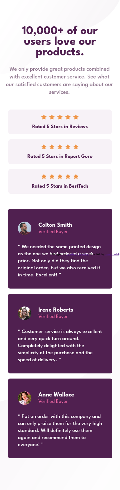

# Frontend Mentor - Social proof section solution

This is a solution to the [Social proof section challenge on Frontend Mentor](https://www.frontendmentor.io/challenges/social-proof-section-6e0qTv_bA). Frontend Mentor challenges help you improve your coding skills by building realistic projects. 

## Table of contents

- [Overview](#overview)
  - [The challenge](#the-challenge)
  - [Screenshot](#screenshot)
  - [Links](#links)
- [My process](#my-process)
  - [Built with](#built-with)
  - [What I learned](#what-i-learned)
  - [Continued development](#continued-development)
  - [Useful resources](#useful-resources)
- [Author](#author)
- [Acknowledgments](#acknowledgments)

## Overview

### The challenge

Users should be able to:

- View the optimal layout for the section depending on their device's screen size

### Screenshot

#### Mobile

#### Desktop

### Links

- Solution URL: [https://github.com/JunoField/fm6-social-proof-section/(https://github.com/JunoField/fm6-social-proof-section/)
- Live Site URL: [https://junofield.github.io/fm6-social-proof-section/](https://junofield.github.io/fm6-social-proof-section/)

## My process

### Built with

- Semantic HTML5 markup
- CSS custom properties
- JavaScript and HTML DOM
- Mobile-first workflow
- [SASS](https://sass-lang.com/) - CSS extension framework
- [Parcel](https://parceljs.org/) - Provides testing server, build tools, etc.

### Continued development

When using a screen size other than the provided 1440x800 for desktop, the layout looks very stretched-out. More practice with design should help regarding knowing when to use px vs relative sizing.

**Note: Delete this note and the content within this section and replace with your own plans for continued development.**

### Author

- GitHub - [JunoField](https://github.com/JunoField)
- Frontend Mentor - [@JunoField](https://www.frontendmentor.io/profile/JunoField)
